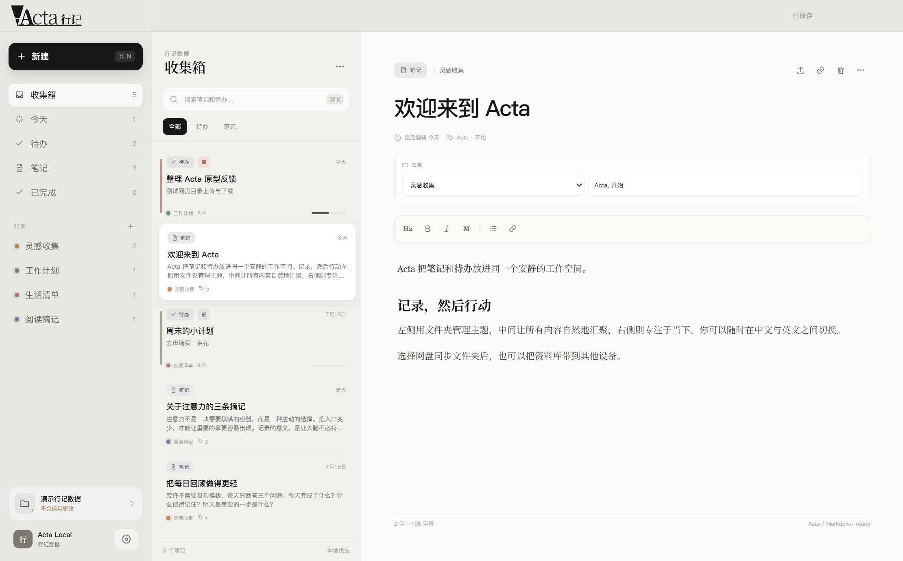
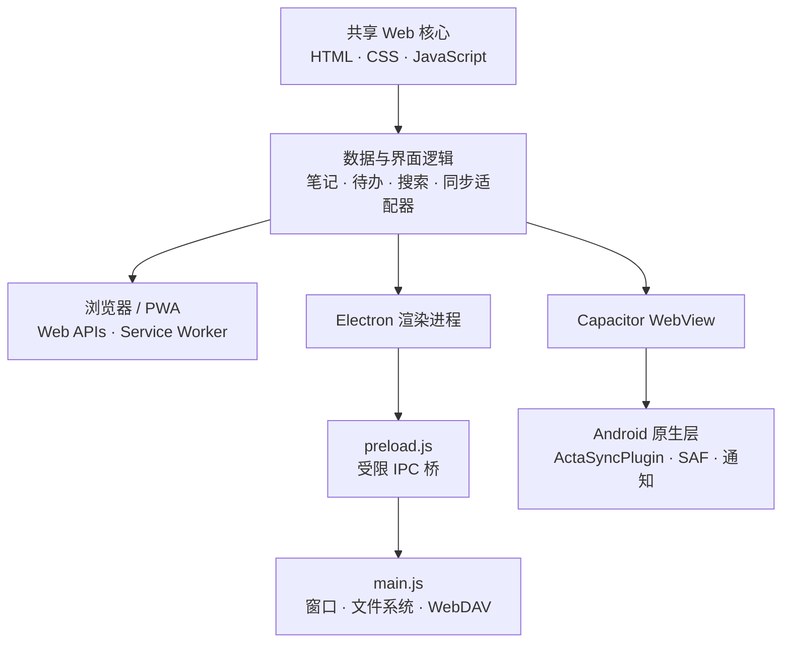

<p align="right">
  <strong>简体中文</strong> · <a href="./README_EN.md">English</a>
</p>

# Acta · 行记

Acta 是一个本地优先的笔记与待办应用，把记录、行动和资料整理放在一个安静的工作空间中。项目共用一套 Web 界面，并通过 Electron 提供桌面版、通过 Capacitor 提供 Android 版，也可以作为 PWA 在现代浏览器中运行。



## 功能

- 笔记与待办双向关联，可从任一编辑器建立、跳转或解除关系
- 高、中、低三级待办优先级，以及子任务、进度和截止时间
- 文件夹、智能视图和笔记/待办统一搜索
- 富文本编辑与 UTF-8 Markdown 单笔记导入、导出
- 简体中文、繁体中文和英文界面，以及多种主题和字体设置
- 本地数据文件夹、OneDrive 本地同步目录和 WebDAV 同步
- Android 本地通知、系统文件选择器和 Storage Access Framework 支持
- 可安装 PWA 与离线缓存

## 快速开始

需要已安装 Node.js 与 npm。

```bash
npm install
npm start
```

常用命令：

| 命令 | 用途 |
| --- | --- |
| `npm start` | 启动 Electron 桌面应用 |
| `npm test` | 运行 Electron 冒烟测试 |
| `npm run windows:build` | 生成 Windows 便携包和安装程序 |
| `npm run android:sync` | 将共享 Web 资源同步到 Android 工程 |
| `npm run android:build` | 同步资源并构建 Android debug APK |

Android 构建还需要 JDK 17 和 Android SDK 34。生成的 debug APK 位于 `android/app/build/outputs/apk/debug/app-debug.apk`，不会提交到源码仓库。

## 项目架构

Acta 采用“共享 Web 核心 + 平台适配层”的结构。笔记、待办、视图和大部分同步逻辑只维护一份；平台层仅负责系统能力，例如窗口、文件选择、目录访问、网络代理和通知。



### 目录说明

| 路径 | 职责 |
| --- | --- |
| `src/` | 共享界面、核心业务逻辑、PWA manifest、Service Worker 和图标 |
| `main.js` | Electron 主进程；创建安全窗口并处理文件、目录及 WebDAV IPC |
| `preload.js` | 使用 `contextBridge` 向渲染进程暴露最小化桌面 API |
| `android/` | Capacitor Android 工程和 `ActaSyncPlugin` 原生文件桥 |
| `scripts/` | 冒烟测试、Windows 打包和 Android 图标生成脚本 |
| `build/` | 受版本控制的 Windows 图标与 NSIS 配置；临时打包内容被忽略 |
| `resources/` | Electron 应用图标等桌面资源 |

### 数据与同步

- 核心资料默认保存在设备本地；浏览器设置使用 `localStorage`，目录句柄使用 IndexedDB。
- 数据文件夹格式由 `acta-manifest.json`、`classifications.json`、`notes/` 和 `todos/` 组成，每则笔记和待办分别保存。
- Electron 通过受限 IPC 访问系统文件与 WebDAV；Android 通过自定义 Capacitor 插件和 Storage Access Framework 访问用户授权的目录。
- OneDrive 模式使用本地同步目录，不读取用户的 Microsoft 账户；WebDAV 凭据只用于用户配置的服务器。

## 测试

```bash
npm test
```

冒烟测试覆盖输入法组合输入、视图筛选、已完成任务、双向关联、优先级排序、Markdown 往返转换和不安全链接过滤。

## 许可证

本项目采用 [MIT License](./LICENSE)。
