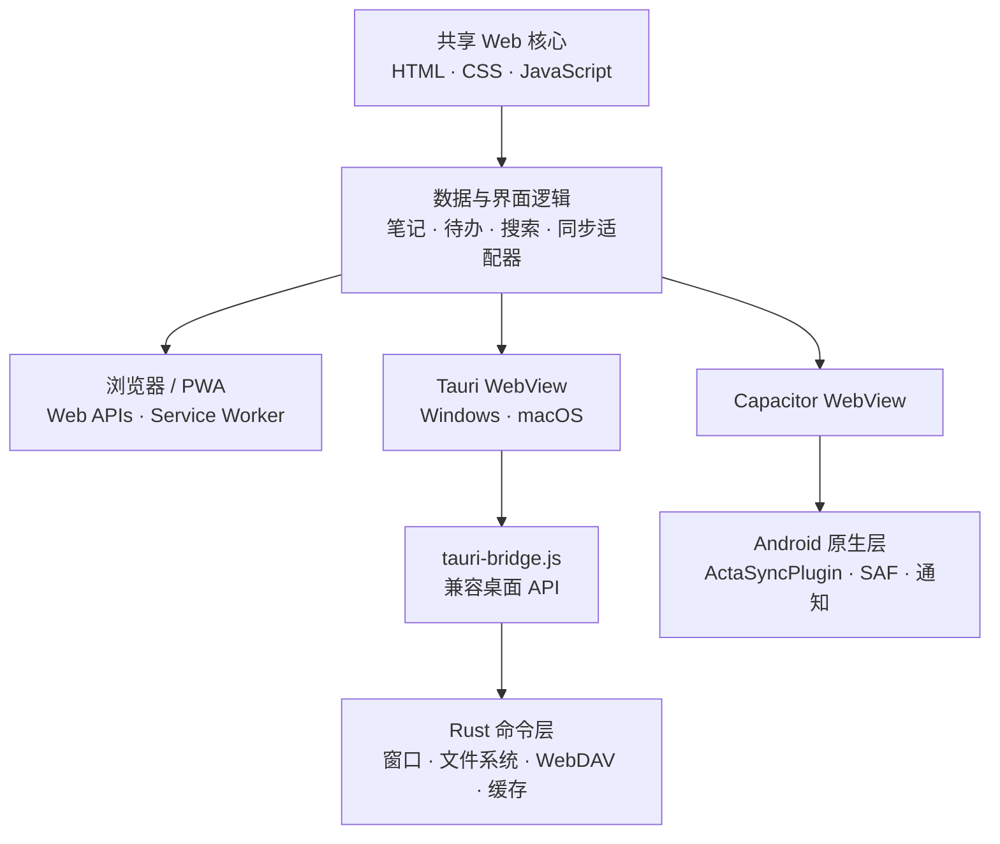

<p align="right">
  <strong>简体中文</strong> · <a href="./README_EN.md">English</a>
</p>

# Acta · 行记

**当前版本 v1.2.0**

Acta 是一个本地优先的笔记与待办应用，把记录、行动和资料整理放在一个安静的工作空间中。项目共用一套 Web 界面，并通过 Tauri 提供 Windows/macOS 桌面版、通过 Capacitor 提供 Android 版，也可以作为 PWA 在现代浏览器中运行。


## 功能

- 笔记与待办双向关联，可从任一编辑器建立、跳转或解除关系
- 高、中、低三级待办优先级，以及子任务、进度、创建时间、可选开始时间和截止时间
- 取代“今天”页面的年、月、周、日日历：月视图显示周数并紧凑浏览，桌面与移动周视图独立滚动，周/日可直接完成或撤销待办与子待办
- 文件夹、智能视图、待办/笔记组合筛选和统一搜索
- 富文本编辑与 UTF-8 Markdown 单笔记导入、导出
- 简体中文、繁体中文和英文界面，以及多种主题和字体设置
- 本地数据文件夹、OneDrive 本地同步目录和 WebDAV 同步
- Android 本地通知、系统文件选择器和 Storage Access Framework 支持
- 可安装 PWA 与离线缓存

## 快速开始

桌面开发需要 Node.js、npm、Rust stable，以及当前平台对应的 Tauri 系统依赖。

```bash
npm install
npm start
```

常用命令：

| 命令 | 用途 |
| --- | --- |
| `npm start` | 启动 Tauri 桌面应用 |
| `npm test` | 使用本机 Edge/Chrome 运行无头冒烟测试 |
| `npm run desktop:build` | 构建当前平台桌面应用 |
| `npm run windows:build` | 生成 Windows x64 NSIS 安装程序 |
| `npm run macos:build` | 在 macOS 上生成 Apple 芯片（aarch64）App 与 DMG |
| `npm run android:sync` | 将共享 Web 资源同步到 Android 工程 |
| `npm run android:build` | 同步资源并构建 Android debug APK |

Android 构建需要 JDK 21、Android SDK 36 和 Node.js 22（Capacitor 8 要求）。生成的 debug APK 位于 `android/app/build/outputs/apk/debug/app-debug.apk`，不会提交到源码仓库。

## 项目架构

Acta 采用“共享 Web 核心 + 平台适配层”的结构。笔记、待办、视图和大部分同步逻辑只维护一份；平台层仅负责系统能力，例如窗口、文件选择、目录访问、网络代理和通知。


```mermaid
flowchart TB
    Core["共享 Web 核心<br/>HTML · CSS · JavaScript"]
    Model["数据与界面逻辑<br/>笔记 · 待办 · 搜索 · 同步适配器"]
    PWA["浏览器 / PWA<br/>Web APIs · Service Worker"]
    Tauri["Tauri WebView<br/>Windows · macOS"]
    Bridge["tauri-bridge.js<br/>兼容桌面 API"]
    Rust["Rust 命令层<br/>窗口 · 文件系统 · WebDAV · 缓存"]
    Android["Capacitor WebView"]
    Native["Android 原生层<br/>ActaSyncPlugin · SAF · 通知"]

    Core --> Model
    Model --> PWA
    Model --> Tauri --> Bridge --> Rust
    Model --> Android --> Native
```

### 目录说明

| 路径 | 职责 |
| --- | --- |
| `src/` | 共享界面、核心业务逻辑、PWA manifest、Service Worker 和图标 |
| `src/tauri-bridge.js` | 把 Tauri 命令、系统对话框和窗口控制适配为共享桌面 API |
| `src-tauri/` | Tauri 2 配置、Rust 原生命令、桌面权限与 Windows/macOS 图标 |
| `android/` | Capacitor Android 工程和 `ActaSyncPlugin` 原生文件桥 |
| `scripts/` | 无头浏览器冒烟测试和 Android 图标生成脚本 |

### 平台构建配置

桌面版在共享基础配置之上合并平台专用配置，平台专用文件单独标注如下：

| 文件 | 适用平台 | 说明 |
| --- | --- | --- |
| `src-tauri/tauri.conf.json` | 通用基础 | 产品名、标识符、图标等共享配置 |
| `src-tauri/tauri.macos.conf.json` | **macOS 专用** | Overlay 标题栏与红绿灯位置、最低 macOS 10.13、输出 `.app` 与 `.dmg` |
| `src-tauri/tauri.windows.conf.json` | **Windows 专用** | NSIS 安装程序、WebView2 引导安装与安装语言选择 |

macOS 构建目标为 Apple 芯片（`aarch64-apple-darwin`），由 `package.json` 的 `macos:build` 脚本指定；如需 Intel 或通用架构，请改用 `x86_64-apple-darwin` 或 `universal-apple-darwin` 目标。

### 数据与同步

- 核心资料默认保存在设备本地；浏览器设置使用 `localStorage`，目录句柄使用 IndexedDB。
- 数据文件夹格式由 `acta-manifest.json`、`classifications.json`、`notes/` 和 `todos/` 组成，每则笔记和待办分别保存。
- Tauri 通过受限 Rust 命令访问系统文件、WebDAV 与缓存；Android 通过自定义 Capacitor 插件和 Storage Access Framework 访问用户授权的目录。
- OneDrive 模式使用本地同步目录，不读取用户的 Microsoft 账户；WebDAV 凭据只用于用户配置的服务器。

## 测试

```bash
npm test
```

冒烟测试覆盖待办默认归类、创建/开始/截止时间、日历移动端交互、周列表滚动、待办与子待办快捷完成、输入法组合输入、视图筛选、双向关联和 Markdown 往返转换。

## 许可证

本项目采用 [MIT License](./LICENSE)。
