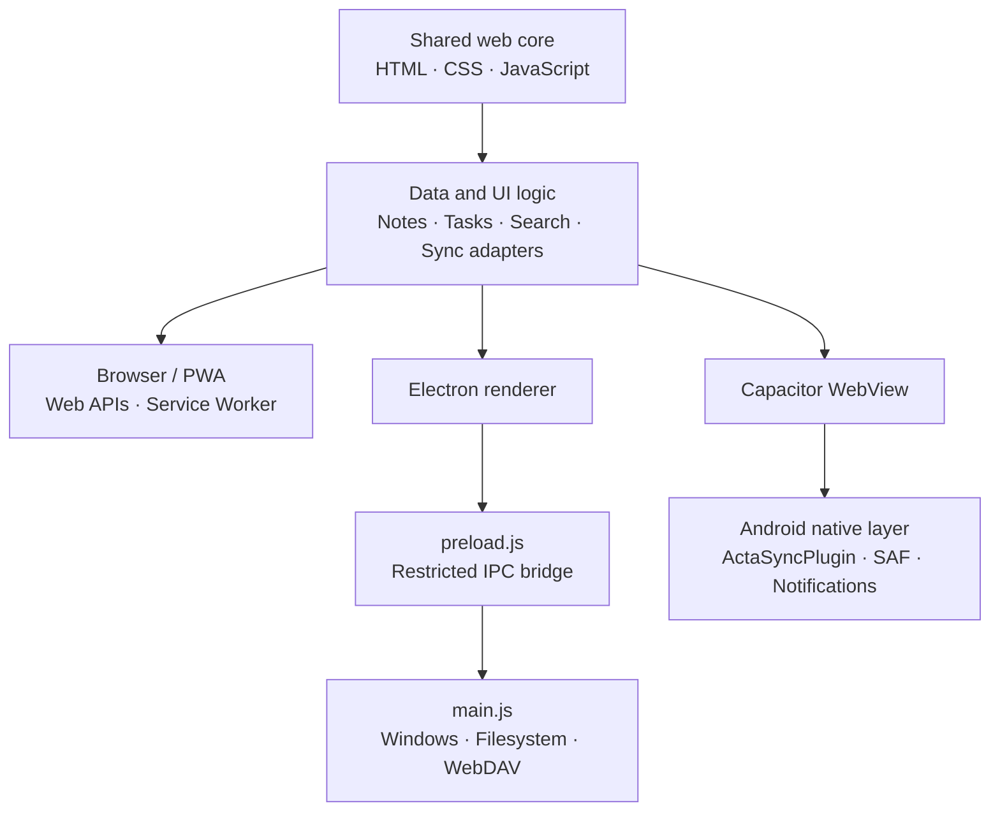

<p align="right">
  <a href="./README.md">简体中文</a> · <strong>English</strong>
</p>

# Acta · 行记

Acta is a local-first notes and tasks app that brings writing, action, and organization into one calm workspace. The project shares a single web interface across an Electron desktop app, a Capacitor Android app, and a modern-browser PWA.


## Features

- Bidirectional links between notes and tasks, with navigation and unlinking from either editor
- High, medium, and low task priorities, plus subtasks, progress, and due dates
- Folders, smart views, and unified search across notes and tasks
- Rich-text editing and UTF-8 Markdown import/export for individual notes
- Simplified Chinese, Traditional Chinese, and English interfaces with theme and font settings
- Local data folders, OneDrive local-folder sync, and WebDAV sync
- Android local notifications, system file pickers, and Storage Access Framework integration
- Installable PWA support with offline caching

## Quick start

Node.js and npm are required.

```bash
npm install
npm start
```

Common commands:

| Command | Purpose |
| --- | --- |
| `npm start` | Start the Electron desktop app |
| `npm test` | Run the Electron smoke test |
| `npm run windows:build` | Build the Windows portable package and installer |
| `npm run android:sync` | Sync shared web assets into the Android project |
| `npm run android:build` | Sync assets and build an Android debug APK |

Android builds also require JDK 17 and Android SDK 34. The debug APK is generated at `android/app/build/outputs/apk/debug/app-debug.apk` and is not committed to the source repository.

## Architecture

Acta follows a “shared web core + platform adapters” design. Notes, tasks, views, and most synchronization logic have a single implementation. Platform layers only provide system capabilities such as windows, file pickers, directory access, network proxying, and notifications.



### Repository layout

| Path | Responsibility |
| --- | --- |
| `src/` | Shared UI, core application logic, PWA manifest, service worker, and icons |
| `main.js` | Electron main process; creates the secured window and handles file, folder, and WebDAV IPC |
| `preload.js` | Exposes a minimal desktop API to the renderer through `contextBridge` |
| `android/` | Capacitor Android project and the native `ActaSyncPlugin` file bridge |
| `scripts/` | Smoke tests, Windows packaging, and Android icon generation |
| `build/` | Versioned Windows icons and NSIS configuration; temporary staging files are ignored |
| `resources/` | Electron application icons and other desktop resources |

### Data and synchronization

- Core data stays on the device by default; browser settings use `localStorage`, while directory handles use IndexedDB.
- A data folder contains `acta-manifest.json`, `classifications.json`, `notes/`, and `todos/`, with each note and task stored separately.
- Electron uses restricted IPC for system files and WebDAV; Android uses a custom Capacitor plugin and the Storage Access Framework for user-authorized directories.
- OneDrive mode works through a local synchronized folder and does not access the user's Microsoft account. WebDAV credentials are used only for the server configured by the user.

## Testing

```bash
npm test
```

The smoke test covers IME composition, strict view filtering, completed tasks, bidirectional links, priority ordering, Markdown round-trips, and unsafe-link filtering.

## License

This project is licensed under the [MIT License](./LICENSE).
