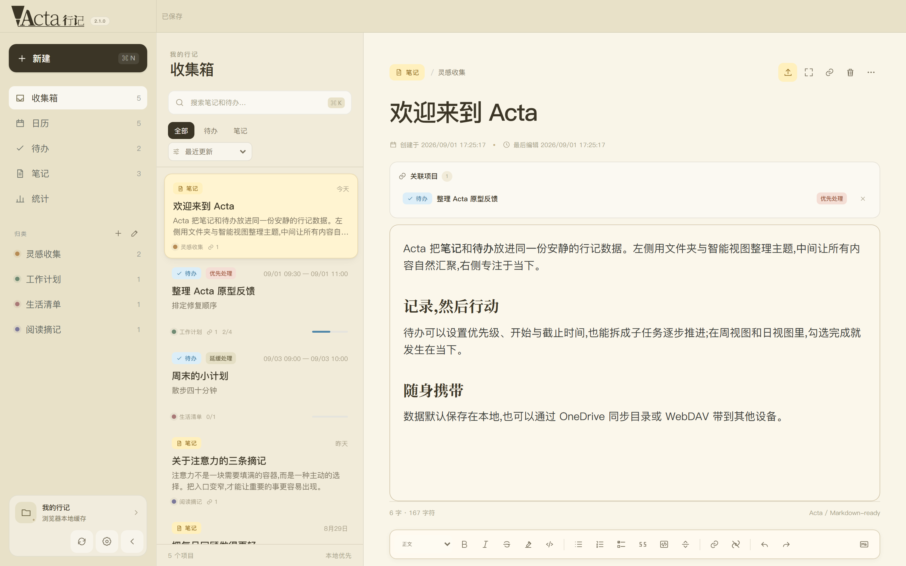
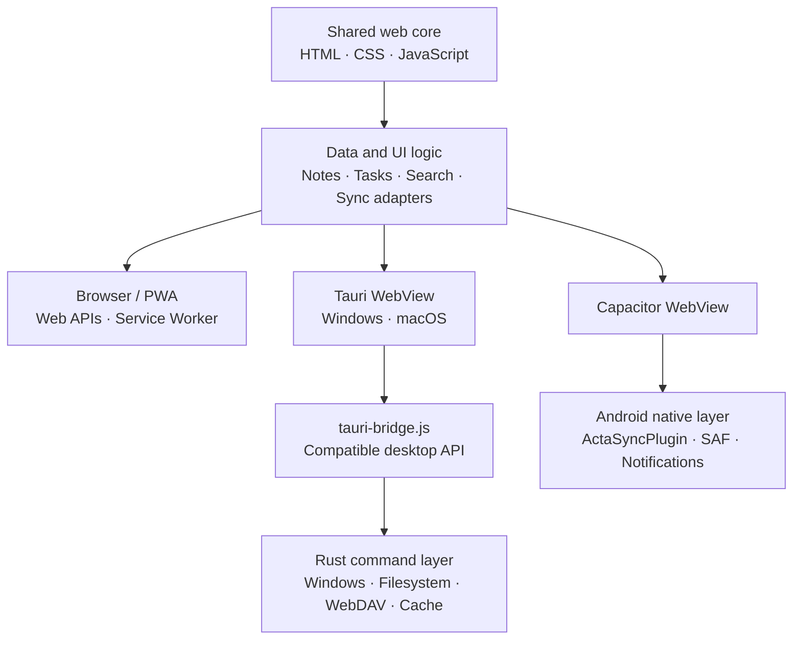

<p align="right">
  <a href="./README.md">简体中文</a> · <strong>English</strong>
</p>

# Acta · 行记

**Current version v1.2.0**

Acta is a local-first notes and tasks app that brings writing, action, and organization into one calm workspace. The project shares a single web interface across Tauri desktop apps for Windows/macOS, a Capacitor Android app, and a modern-browser PWA.



## Features

- Bidirectional links between notes and tasks, with navigation and unlinking from either editor
- High, medium, and low task priorities, plus subtasks, progress, immutable creation time, and optional start/due times
- A year/month/week/day calendar replacing Today: week numbers in the compact month view, independently scrollable desktop/mobile week layouts, and direct task/subtask completion in week and day views
- Folders, smart views, combinable task/note filters, and unified search
- Rich-text editing and UTF-8 Markdown import/export for individual notes
- Simplified Chinese, Traditional Chinese, and English interfaces with theme and font settings
- Local data folders, OneDrive local-folder sync, and WebDAV sync
- Android local notifications, system file pickers, and Storage Access Framework integration
- Installable PWA support with offline caching

## Quick start

Desktop development requires Node.js, npm, Rust stable, and the Tauri system dependencies for the host platform.

```bash
npm install
npm start
```

Common commands:

| Command | Purpose |
| --- | --- |
| `npm start` | Start the Tauri desktop app |
| `npm test` | Run the headless smoke test with local Edge/Chrome |
| `npm run desktop:build` | Build the desktop app for the current platform |
| `npm run windows:build` | Build the Windows x64 NSIS installer |
| `npm run macos:build` | Build an Apple Silicon (aarch64) macOS App and DMG on macOS |
| `npm run android:sync` | Sync shared web assets into the Android project |
| `npm run android:build` | Sync assets and build an Android debug APK |

Android builds require JDK 21, Android SDK 36, and Node.js 22 (Capacitor 8 requirements). The debug APK is generated at `android/app/build/outputs/apk/debug/app-debug.apk` and is not committed to the source repository.

## Architecture

Acta follows a “shared web core + platform adapters” design. Notes, tasks, views, and most synchronization logic have a single implementation. Platform layers only provide system capabilities such as windows, file pickers, directory access, network proxying, and notifications.


```mermaid
flowchart TB
    Core["Shared web core<br/>HTML · CSS · JavaScript"]
    Model["Data and UI logic<br/>Notes · Tasks · Search · Sync adapters"]
    PWA["Browser / PWA<br/>Web APIs · Service Worker"]
    Tauri["Tauri WebView<br/>Windows · macOS"]
    Bridge["tauri-bridge.js<br/>Compatible desktop API"]
    Rust["Rust command layer<br/>Windows · Filesystem · WebDAV · Cache"]
    Android["Capacitor WebView"]
    Native["Android native layer<br/>ActaSyncPlugin · SAF · Notifications"]

    Core --> Model
    Model --> PWA
    Model --> Tauri --> Bridge --> Rust
    Model --> Android --> Native
```

### Repository layout

| Path | Responsibility |
| --- | --- |
| `src/` | Shared UI, core application logic, PWA manifest, service worker, and icons |
| `src/tauri-bridge.js` | Adapts Tauri commands, system dialogs, and window controls to the shared desktop API |
| `src-tauri/` | Tauri 2 configuration, Rust commands, desktop permissions, and Windows/macOS icons |
| `android/` | Capacitor Android project and the native `ActaSyncPlugin` file bridge |
| `scripts/` | Headless-browser smoke tests and Android icon generation |

### Platform build configuration

The desktop build merges a platform-specific config over the shared base. Platform-dedicated files are marked separately below:

| File | Platform | Notes |
| --- | --- | --- |
| `src-tauri/tauri.conf.json` | Shared base | Product name, identifier, icons, and other shared settings |
| `src-tauri/tauri.macos.conf.json` | **macOS only** | Overlay title bar with traffic-light position, macOS 10.13 minimum, `.app` and `.dmg` bundles |
| `src-tauri/tauri.windows.conf.json` | **Windows only** | NSIS installer, WebView2 bootstrapper, and installer language selector |

The macOS build targets Apple Silicon (`aarch64-apple-darwin`), set by the `macos:build` script in `package.json`. For Intel or universal binaries, switch the target to `x86_64-apple-darwin` or `universal-apple-darwin`.

### Data and synchronization

- Core data stays on the device by default; browser settings use `localStorage`, while directory handles use IndexedDB.
- A data folder contains `acta-manifest.json`, `classifications.json`, `notes/`, and `todos/`, with each note and task stored separately.
- Tauri uses restricted Rust commands for system files, WebDAV, and cache management; Android uses a custom Capacitor plugin and the Storage Access Framework for user-authorized directories.
- OneDrive mode works through a local synchronized folder and does not access the user's Microsoft account. WebDAV credentials are used only for the server configured by the user.

## Testing

```bash
npm test
```

The smoke test covers default task classification, creation/start/due times, mobile calendar interaction, week-list scrolling, direct task/subtask completion, IME composition, strict view filtering, bidirectional links, and Markdown round-trips.

## License

This project is licensed under the [MIT License](./LICENSE).
